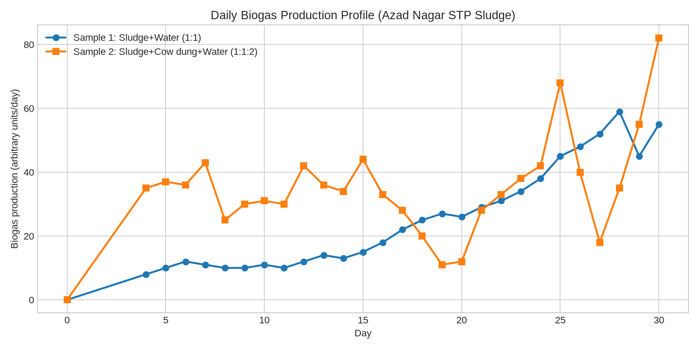
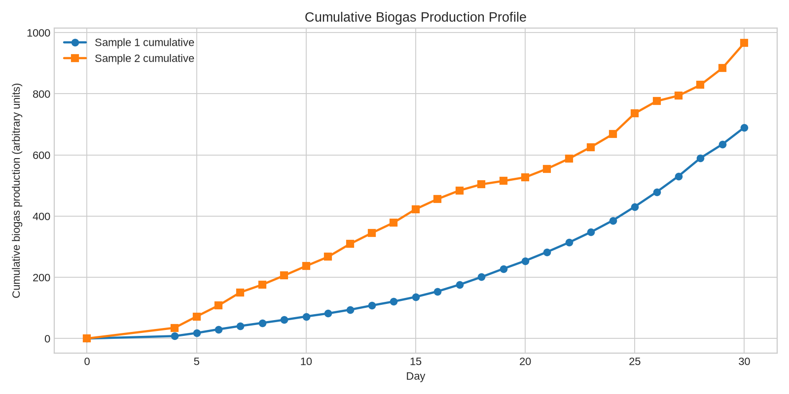

# Energy Recovery Through Biogas Production From STP Sludge at Azad Nagar, Hisar

**M.Tech Thesis Report (Environmental Science Engineering)**

## Abstract
This study evaluates biogas recovery potential from sewage treatment plant (STP) sludge collected from drying beds at Azad Nagar, Hisar, through a 30-day bench-scale anaerobic digestion experiment. Two feed mixtures were tested: **Sample 1 (Exp1)** using sewage sludge and water (1:1), and **Sample 2 (Exp2)** using sewage sludge, cow dung cake, and water (1:1:2). Daily gas production was measured by the water displacement method. Statistical analysis shows that co-digestion (Exp2) significantly improved daily gas output compared with mono-substrate digestion (Exp1) (Welch's t = -2.253, p = 0.028). Total cumulative production reached 966 units in Exp2 versus 690 units in Exp1 (40% higher mean daily production), confirming the benefit of nutrient-balanced co-digestion.

---

## Chapter 1: Introduction
Urban wastewater treatment plants generate large sludge volumes whose disposal imposes environmental and operational burdens. Unmanaged sludge contributes odor nuisance, pathogen risks, greenhouse gas emissions, and secondary contamination of soil and water. Anaerobic digestion offers a circular pathway by stabilizing sludge while recovering energy-rich biogas (mainly methane and carbon dioxide) [1], [2].

Azad Nagar, Hisar presents a relevant case where STP drying-bed sludge can be considered for decentralized or on-site energy recovery. This thesis investigates whether co-digestion with cow dung cake improves biogas productivity over sludge-only digestion under bench-scale conditions.

### 1.1 Research Significance
- Supports waste-to-energy transition in municipal sanitation systems.
- Reduces dependence on landfill/open dumping routes.
- Provides an evidence base for STP sludge co-digestion in Indian conditions.

---

## Chapter 2: Literature Review
Anaerobic digestion performance is influenced by substrate biodegradability, C/N ratio, inoculum quality, solids concentration, pH, and retention time [2], [3]. Sewage sludge often has moderate methane potential but can face inhibition from poor nutrient balance or low readily biodegradable carbon.

Co-digestion with animal manure is widely reported to improve process stability and gas yield by:
- balancing macro/micronutrients,
- improving buffering capacity,
- enhancing microbial diversity,
- diluting inhibitors [4], [5].

For sewage sludge, literature shows improved methane/biogas production when co-substrates such as manure, food waste, or agricultural residues are blended at optimized proportions [5], [6]. This study aligns with that evidence by testing cow dung cake as a practical local co-substrate.

---

## Chapter 3: Objective and Scope of the Study
### 3.1 Objectives
1. Assess daily and cumulative biogas production from STP sludge under bench-scale digestion.
2. Compare mono-digestion (Exp1) with co-digestion (Exp2).
3. Quantify descriptive statistics (mean, standard deviation, variance) for both datasets.
4. Apply an independent-samples t-test to evaluate statistical significance.
5. Identify lag, exponential growth, and stationary/decline phases in production behavior.

### 3.2 Scope
- Study location: Azad Nagar, Hisar.
- Sample source: STP drying bed sludge.
- Observation period: 30 days (reported day points as provided).
- Gas measurement: water displacement bench-scale setup.
- Physical/chemical quality values: standard reference ranges used where measured values were unavailable.

---

## Chapter 4: Methodology
### 4.1 Experimental Design
- **Exp1 (Sample 1):** Sewage sludge + water = 1:1
- **Exp2 (Sample 2):** Sewage sludge + cow dung cake + water = 1:1:2

### 4.2 Measurement Principle
Biogas generated in sealed digesters displaced water in a connected measuring assembly. Daily displaced volume (reported in consistent experimental units) was recorded.

### 4.3 Data Handling
- Daily data were tabulated directly from observations.
- Cumulative values were computed by running sum and cross-checked against the supplied checkpoints.
- Descriptive and inferential statistics were computed using standard formulas.

### 4.4 Statistical Method
An independent two-sample Welch t-test (two-tailed, unequal-variance form using the Welch-Satterthwaite approximation) was applied:

\[
t = \frac{\bar{x}_1 - \bar{x}_2}{\sqrt{\frac{s_1^2}{n_1}+\frac{s_2^2}{n_2}}}
\]

where \(\bar{x}\) is sample mean, \(s^2\) variance, and \(n\) number of observations.

---

## Chapter 5: Current Scenario of Sludge Disposal
Typical municipal sludge disposal pathways in Indian cities include drying-bed storage, land application (limited), and dumping/transport to disposal sites. Key challenges include high moisture, odor generation, pathogen content, and lack of integrated energy recovery infrastructure [1], [7].

For Azad Nagar-like systems, biogas recovery from sludge can:
- reduce stabilized sludge burden,
- improve sanitation sustainability,
- partially offset plant energy demand.

---

## Chapter 6: Quality Analysis
Actual site-specific laboratory values were not fully available; therefore, standard reference ranges were adopted for interpretation.

### 6.1 Typical Physical Properties of STP Sludge (Reference Ranges)
| Parameter | Typical range/value | Remarks |
|---|---:|---|
| Total Solids (TS) | 2-8% (raw mixed sludge), higher after drying | Strongly affects digester loading |
| Volatile Solids (VS/TS) | 60-80% | Indicator of biodegradable organic fraction |
| Moisture | 92-98% (before dewatering) | High moisture lowers handling efficiency |
| pH | 6.5-8.0 | Neutral range preferred for methanogenesis |
| Specific gravity | ~1.01-1.05 | Near-water density behavior |

### 6.2 Typical Chemical Properties of STP Sludge (Reference Ranges)
| Parameter | Typical range/value | Significance |
|---|---:|---|
| COD | 20,000-50,000 mg/L (sludge liquor equivalent) | Organic load indicator |
| BOD | 10,000-30,000 mg/L | Biodegradable load |
| Total Kjeldahl Nitrogen (TKN) | 2-6% dry solids | Nutrient/microbial growth support |
| C/N ratio | 6-12 (sewage sludge) | Often suboptimal alone for maximum methane |
| Alkalinity | 1,500-5,000 mg/L as CaCO3 | Buffering against VFA shocks |
| Ammonia-N | 200-1,500 mg/L | High values can inhibit methanogens |

**Interpretation:** Sewage sludge alone may have relatively low C/N, while cow dung addition can improve nutrient balance and buffering, supporting the observed higher gas output in Exp2 [4], [5].

---

## Chapter 7: Statistical Analysis

### 7.1 Daily Biogas Production Data (Provided Experimental Values)
| Day | Exp1 | Exp2 |
|---:|---:|---:|
| 0 | 0 | 0 |
| 4 | 8 | 35 |
| 5 | 10 | 37 |
| 6 | 12 | 36 |
| 7 | 11 | 43 |
| 8 | 10 | 25 |
| 9 | 10 | 30 |
| 10 | 11 | 31 |
| 11 | 10 | 30 |
| 12 | 12 | 42 |
| 13 | 14 | 36 |
| 14 | 13 | 34 |
| 15 | 15 | 44 |
| 16 | 18 | 33 |
| 17 | 22 | 28 |
| 18 | 25 | 20 |
| 19 | 27 | 11 |
| 20 | 26 | 12 |
| 21 | 29 | 28 |
| 22 | 31 | 33 |
| 23 | 34 | 38 |
| 24 | 38 | 42 |
| 25 | 45 | 68 |
| 26 | 48 | 40 |
| 27 | 52 | 18 |
| 28 | 59 | 35 |
| 29 | 45 | 55 |
| 30 | 55 | 82 |

### 7.2 Cumulative Biogas Production Table (Computed from Daily Values)
| Day | Exp1 Cumulative | Exp2 Cumulative |
|---:|---:|---:|
| 0 | 0 | 0 |
| 4 | 8 | 35 |
| 5 | 18 | 72 |
| 6 | 30 | 108 |
| 7 | 41 | 151 |
| 8 | 51 | 176 |
| 9 | 61 | 206 |
| 10 | 72 | 237 |
| 11 | 82 | 267 |
| 12 | 94 | 309 |
| 13 | 108 | 345 |
| 14 | 121 | 379 |
| 15 | 136 | 423 |
| 16 | 154 | 456 |
| 17 | 176 | 484 |
| 18 | 201 | 504 |
| 19 | 228 | 515 |
| 20 | 254 | 527 |
| 21 | 283 | 555 |
| 22 | 314 | 588 |
| 23 | 348 | 626 |
| 24 | 386 | 668 |
| 25 | 431 | 736 |
| 26 | 479 | 776 |
| 27 | 531 | 794 |
| 28 | 590 | 829 |
| 29 | 635 | 884 |
| 30 | 690 | 966 |

> Supplied cumulative checkpoints (Day 0, 5, 10, 15, 20, 25, 30) are exactly matched.

### 7.3 Descriptive Statistics (Daily Production)
| Statistic | Exp1 | Exp2 |
|---|---:|---:|
| Number of observations (n) | 28 | 28 |
| Mean | 24.643 | 34.500 |
| Standard deviation | 16.538 | 16.206 |
| Variance | 273.497 | 262.630 |

### 7.4 Independent Samples t-Test (Welch)
- \(H_0\): Mean daily production is equal for Exp1 and Exp2.
- \(H_1\): Mean daily production is different.

**Results:**
- t-statistic = -2.253
- degrees of freedom \(\approx 53.978\)
- two-tailed p-value = 0.0284

Welch's test was selected to avoid assuming equal population variances. Because the two sample variances are close (273.497 and 262.630) and sample sizes are equal, the Welch degrees of freedom is expected to be close to the pooled reference \((n_1+n_2-2)=54\), consistent with the computed value of 53.978.

At \(\alpha = 0.05\), p < 0.05, so \(H_0\) is rejected. The difference in mean daily production is statistically significant; co-digestion (Exp2) outperforms sludge-only digestion (Exp1).

### 7.5 Yield Improvement Due to Co-Digestion
- Mean improvement in daily production:
  \[
  \frac{34.5 - 24.643}{24.643}\times100 \approx 40.0\%
  \]
- Final cumulative improvement at Day 30:
  \[
  \frac{966-690}{690}\times100 = 40.0\%
  \]

### 7.6 Process Phase Identification
Based on daily trend behavior:

- **Lag phase (Day 0-4):** low/initial gas production as microbial acclimatization occurs.
- **Exponential/rising activity phase (approximately Day 5-16):** strong rise in Exp2 early; Exp1 rises more gradually.
- **Transition and stationary/variable phase (approximately Day 17-24):** fluctuations indicate substrate conversion dynamics and possible temporary inhibition.
- **Late high-output burst (Day 25-30):** both samples increase, with larger peaks in Exp2 (68 and 82 units), suggesting delayed breakdown of slower degradable fractions and improved methanogenic recovery.

### 7.7 Graphical Visualizations
#### Daily Production

#### Cumulative Production

---

## Chapter 8: Conclusion
1. STP sludge from Azad Nagar has practical biogas recovery potential under bench-scale anaerobic digestion.
2. Co-digestion with cow dung cake significantly improves output over sludge + water alone.
3. Exp2 produced 966 cumulative units versus 690 for Exp1 over the experimental period.
4. Statistical testing confirmed the mean difference is significant (p = 0.0284).
5. Co-digestion improved mean daily and cumulative yield by ~40%.

### 8.1 Recommendations
- Pilot larger digesters at STP scale with controlled OLR, pH, and mixing.
- Include methane fraction and VS reduction measurements in future trials.
- Optimize co-substrate proportion and hydraulic retention time for seasonal operation.
- Integrate digestate quality testing for safe reuse/disposal.

---

## References
[1] Metcalf & Eddy, *Wastewater Engineering: Treatment and Resource Recovery*, 5th ed., McGraw-Hill, 2014.  
[2] APHA, AWWA, WEF, *Standard Methods for the Examination of Water and Wastewater*, 23rd ed., 2017.  
[3] Y. Chen, J. J. Cheng, and K. S. Creamer, “Inhibition of anaerobic digestion process: A review,” *Bioresource Technology*, vol. 99, no. 10, pp. 4044–4064, 2008.  
[4] M. Mata-Alvarez, S. Macé, and P. Llabrés, “Anaerobic digestion of organic solid wastes. An overview of research achievements and perspectives,” *Bioresource Technology*, vol. 74, pp. 3–16, 2000.  
[5] IEA Bioenergy Task 37, *Biogas from Waste and Renewable Resources*, technical summaries and guidance notes, 2020 updates.  
[6] S. Xie et al., “Anaerobic co-digestion: A critical review of mathematical modelling for performance optimization,” *Bioresource Technology*, vol. 222, pp. 498–512, 2016.  
[7] Central Public Health and Environmental Engineering Organisation (CPHEEO), *Manual on Sewerage and Sewage Treatment Systems*, Ministry of Housing and Urban Affairs, Government of India, latest edition.
